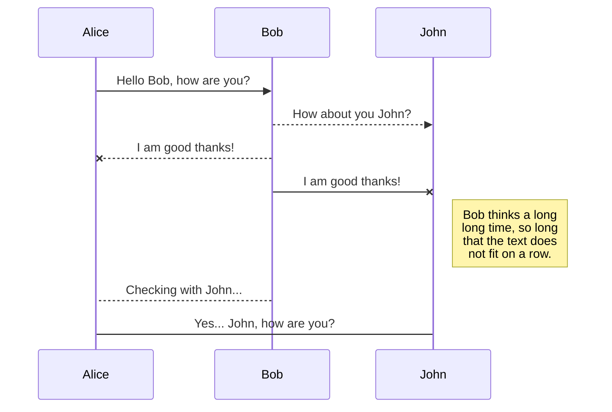
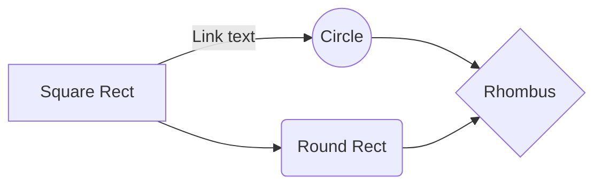

# Welcome to spatialite-geometry !

This java library to convert spatial databases geometries from text to binaries and vice-versa.

Supported databases:
- Spatialite
- PostGis

Supported types:
- Well Known Text 
- Spatialite Query
- Well Known Binary
- GeoJson 

Supported Geometries:
- Point
- LineString
- Polygon
- PolyhedralSurface
- MultiLineString
- MultiPolygon

Supported Coordinates:
- XY
- XYZ
- XYM
- XYZM

# Usage

Use [JitPack](https://jitpack.io/) for Maven / Gradle package managers

## gradle
**Step 1.** Add the JitPack repository to your build file
Add it in your root build.gradle at the end of repositories:

```css
	repositories {
		...
		maven { url 'https://jitpack.io' }
	}
```

**Step 2.** Add the dependency

```css
	dependencies {
		implementation 'com.github.YannCaron:SpatialDB-geometry:<TAG_NAME>'
	}
```
> **note:** Replace <TAG_NAME> by the project version e.g. "1.0.1"
> **see**: JitPack [gradle](https://jitpack.io/#gradle) documentation

## Maven
**Step 1.** Add the JitPack repository to your build file
Add it in your root build.gradle at the end of repositories:

```markup
	<repositories>
		<repository>
		    <id>jitpack.io</id>
		    <url>https://jitpack.io</url>
		</repository>
	</repositories>
```

**Step 2.** Add the dependency

```markup
	<dependency>
	    <groupId>com.github.YannCaron</groupId>
	    <artifactId>SpatialDB-geometry</artifactId>
	    <version>TAG_NAME</version>
	</dependency>
```

> **note:** Replace "TAG_NAME" by the project version e.g. "1.0.1"
> **see**: JitPack [maven](https://jitpack.io/#maven) documentation


# Markdown extensions

StackEdit extends the standard Markdown syntax by adding extra **Markdown extensions**, providing you with some nice features.

> **ProTip:** You can disable any **Markdown extension** in the **File properties** dialog.


## SmartyPants

SmartyPants converts ASCII punctuation characters into "smart" typographic punctuation HTML entities. For example:

|                |ASCII                          |HTML                         |
|----------------|-------------------------------|-----------------------------|
|Single backticks|`'Isn't this fun?'`            |'Isn't this fun?'            |
|Quotes          |`"Isn't this fun?"`            |"Isn't this fun?"            |
|Dashes          |`-- is en-dash, --- is em-dash`|-- is en-dash, --- is em-dash|


## KaTeX

You can render LaTeX mathematical expressions using [KaTeX](https://khan.github.io/KaTeX/):

The *Gamma function* satisfying $\Gamma(n) = (n-1)!\quad\forall n\in\mathbb N$ is via the Euler integral

$$
\Gamma(z) = \int_0^\infty t^{z-1}e^{-t}dt\,.
$$

> You can find more information about **LaTeX** mathematical expressions [here](http://meta.math.stackexchange.com/questions/5020/mathjax-basic-tutorial-and-quick-reference).


## UML diagrams

You can render UML diagrams using [Mermaid](https://mermaidjs.github.io/). For example, this will produce a sequence diagram:



And this will produce a flow chart:


